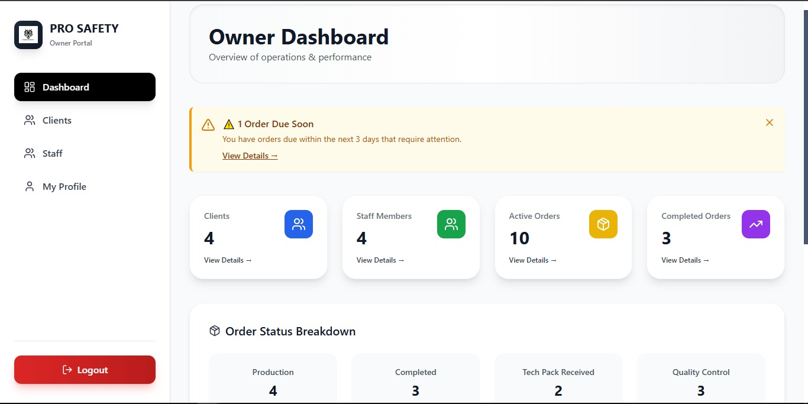
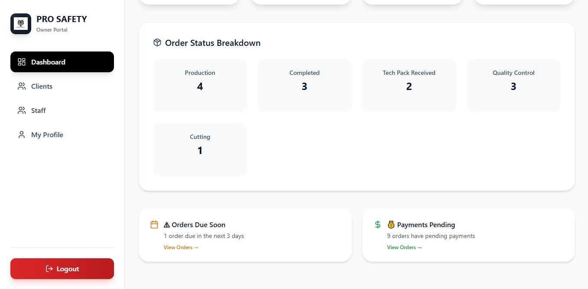
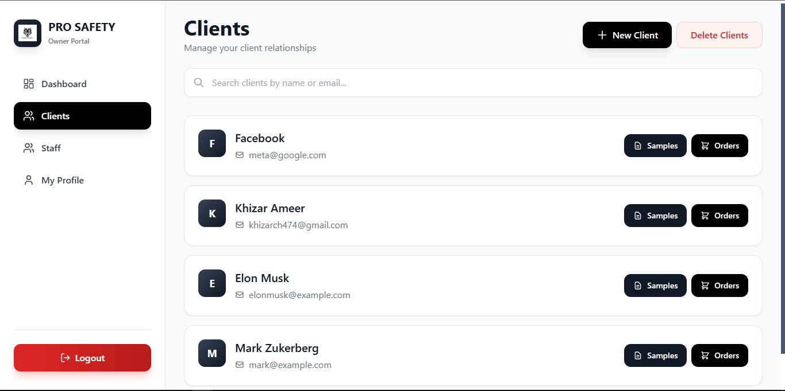
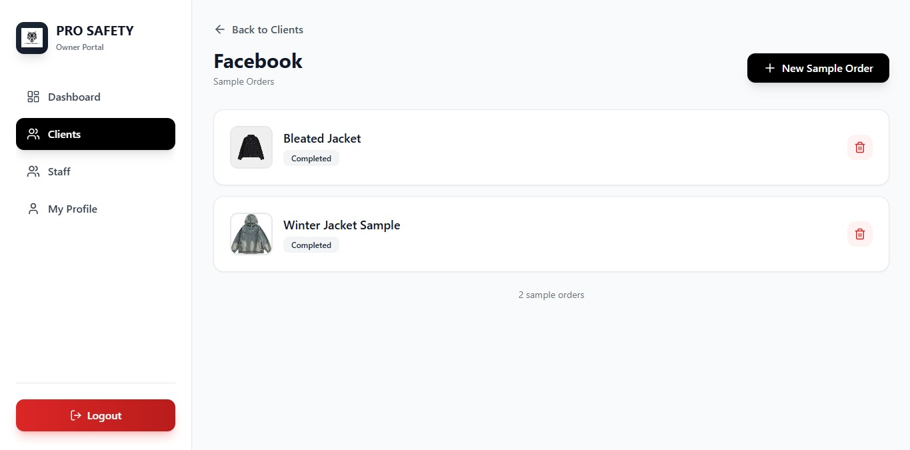
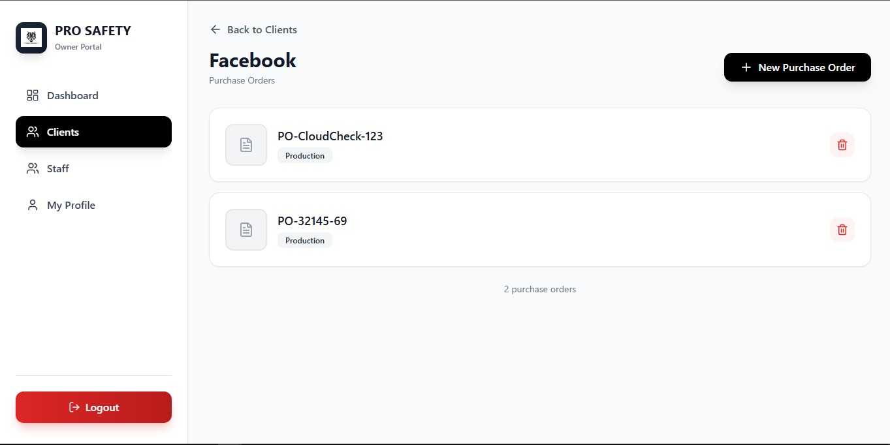
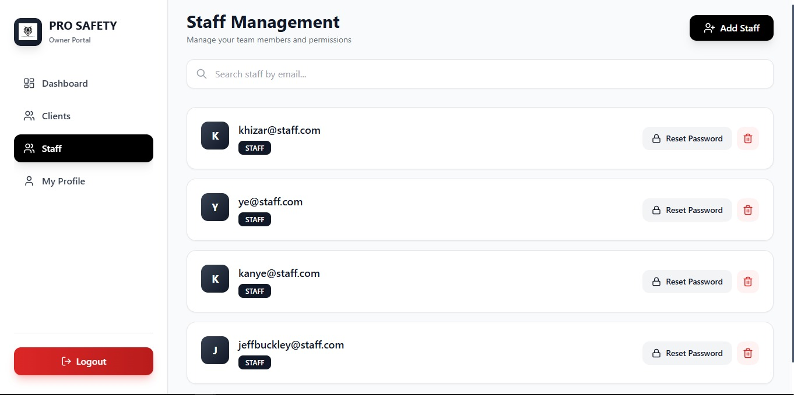
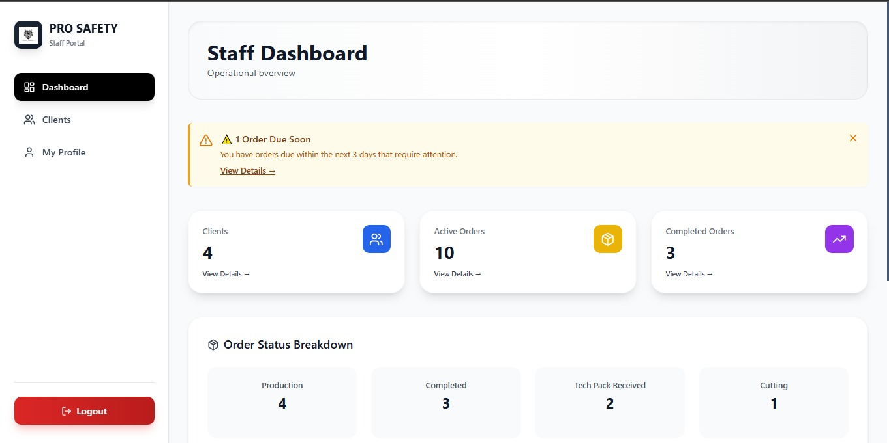
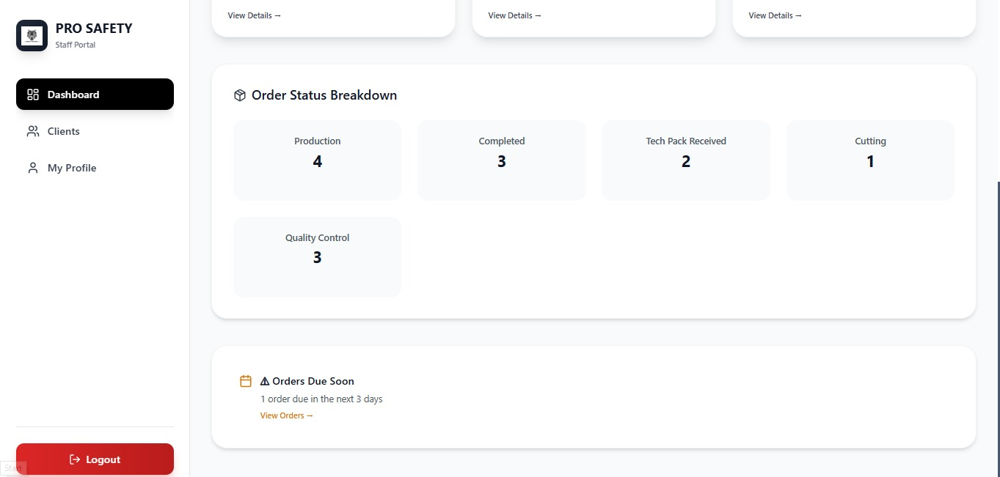
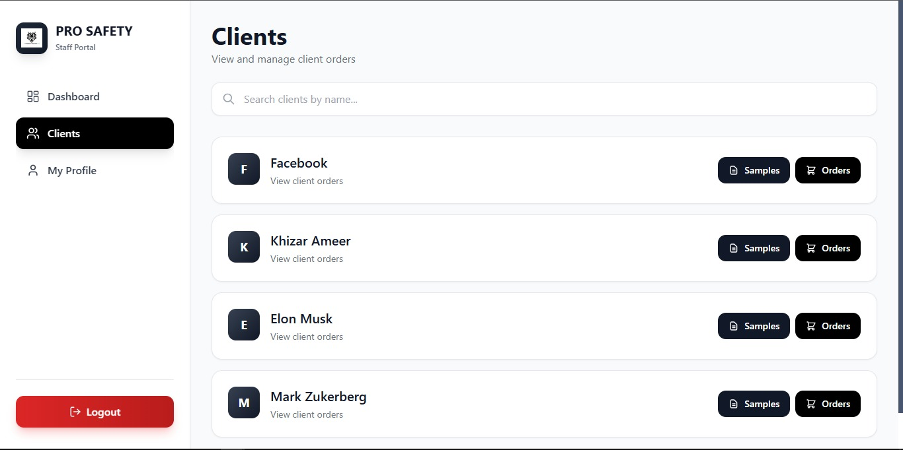
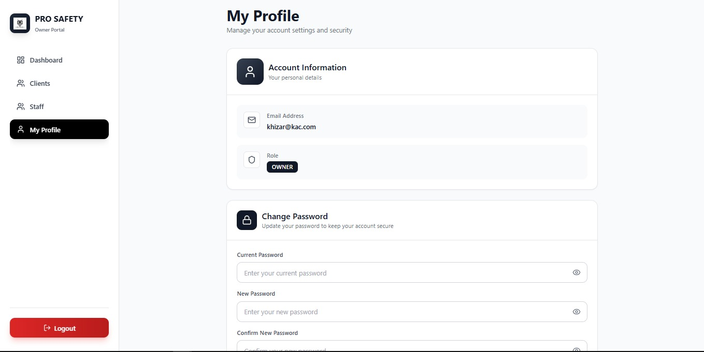

# ProSafety Orders Management System

**ProSafety Orders Management System** is a comprehensive full-stack web application designed for managing manufacturing orders, clients, and staff in production environments. It features role-based dashboards with distinct permissions for owners and staff, enabling efficient order tracking, client management, and real-time analytics.

---

## 🚀 Project Repositories

🔗 **Frontend (React):**  
[ProSafety Orders App Frontend](https://github.com/khizr-ameer/PROSAFTEY-Orders-App-Frontend)

🔗 **Backend (Node.js + Express):**  
[ProSafety Orders App Backend](https://github.com/khizr-ameer/PROSAFTEY-Orders-App-Backend)

---

## 💡 What We Built

**ProSafety** streamlines order management for manufacturing businesses with separate dashboards for owners and staff. The system provides comprehensive order tracking, client management, and file handling capabilities with role-based access control.

### 🎯 How It Works

**Owner Dashboard:**
- Complete CRUD operations for clients, orders (Sample & Purchase), and staff
- Reset staff passwords and manage user accounts
- View analytics, reports, and performance metrics
- Full payment tracking and order status management

**Staff Dashboard:**
- View-only access to clients and orders
- Update order status (Pending → In Progress → Completed)
- Track production progress
- Cannot manage staff or perform delete operations

**Key Features:**
- Advanced filtering (search, status, priority, client, order type)
- File uploads for tech packs, invoices, patterns, and product images
- Real-time alerts for due dates and pending payments
- CSV export for purchase orders
- Secure JWT authentication with role-based permissions

---

## 🛠 Tech Stack

**Frontend:**
- React 18.x with Vite
- Tailwind CSS for modern UI
- Axios for API calls

**Backend:**
- Node.js + Express.js
- MongoDB with Mongoose ODM
- JWT Authentication
- Multer for file uploads

**Deployment:**
- Frontend: Vercel
- Backend: Render

---

## 📸 Screenshots

### Owner Dashboard
<table>
  <tr>
    <td></td>
    <td></td>
    <td></td>
  </tr>
  <tr>
    <td></td>
    <td></td>
    <td></td>
  </tr>
</table>

### Staff Dashboard
<table>
  <tr>
    <td></td>
    <td></td>
    <td></td>
  </tr>
</table>

### Profile Page
<table>
  <tr>
    <td></td>
  </tr>
</table>

---

## 🔑 Core Features

**Multi-Role System**
- Owner: Full administrative access
- Staff: View and status update permissions

**Order Management**
- Sample Orders with priority tracking
- Purchase Orders with payment tracking
- Advanced filtering and search
- File attachments support

**Client Management**
- Complete client database
- Order history tracking
- Contact information management

**Analytics & Reports**
- Real-time performance metrics
- Order status breakdown
- Due date alerts
- Payment reminders

---

## 📄 License

MIT License

## 👨‍💻 Author

Created by **Khizar Ameer**  
GitHub: [@khizr-ameer](https://github.com/khizr-ameer)

---

⭐ **Star this repository if you found it helpful!**
