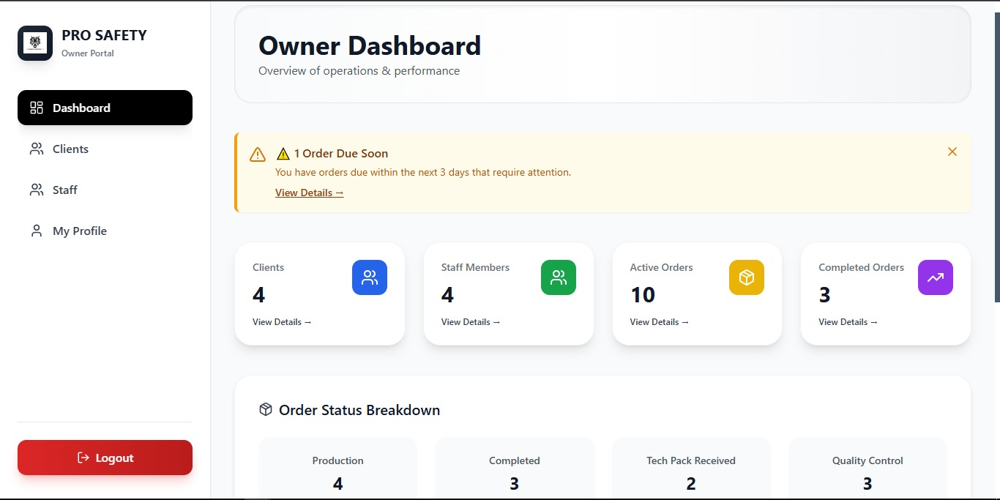
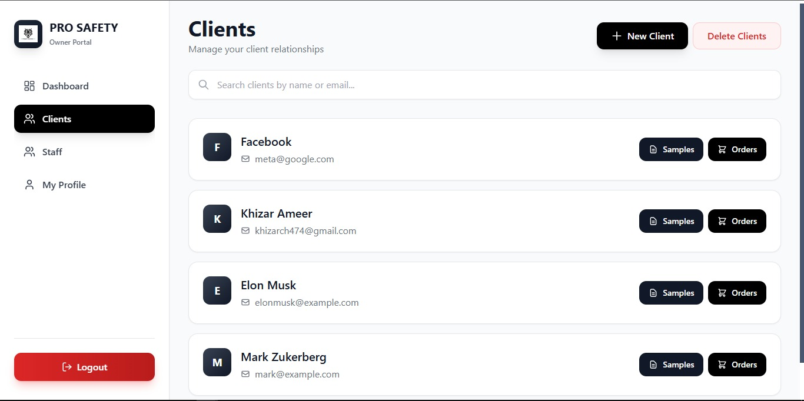
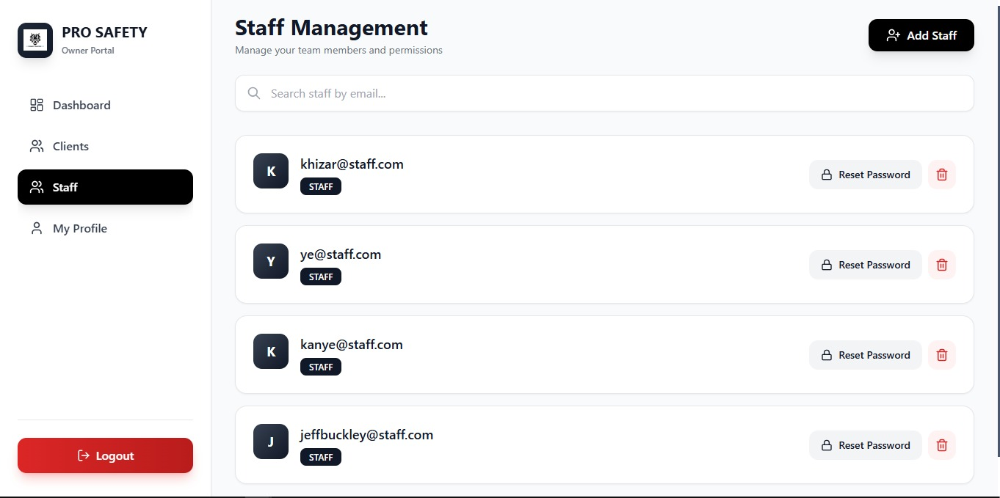
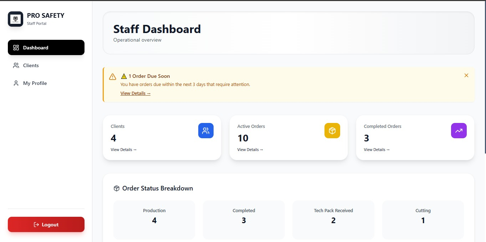

# ProSafety Orders Management System

A comprehensive full-stack order management system built for manufacturing businesses. Manage clients, sample orders, purchase orders, staff, and analytics — all in one place with three separate role-based portals.


---

## 🔗 Repositories

| Repo | Link |
|---|---|
| 🖥️ Frontend (React + Vite) | [ProSafety Orders App Frontend](https://github.com/khizr-ameer/PROSAFTEY-Orders-App-Frontend) |
| ⚙️ Backend (Node.js + Express) | [ProSafety Orders App Backend](https://github.com/khizr-ameer/PROSAFTEY-Orders-App-Backend) |

---

## 💡 What This System Does

ProSafety is a production-ready order management platform for factories and manufacturing businesses. It replaces WhatsApp coordination, paper records, and spreadsheets with a clean, modern web application that gives every stakeholder exactly the access they need.

### Three Portals, One Login

**Owner Portal** — Full control
- Create and manage clients, staff, sample orders, purchase orders
- Set client portal passwords for external access
- Track payments in PKR with progress bars
- Monitor overdue orders and upcoming deadlines
- Download branded Excel reports per purchase order
- View analytics — revenue trends, payment collection rates, top clients
- Trigger and download database backups

**Staff Portal** — Operational access
- View all clients and orders
- Update production status (Tech Pack Received → Cutting → Production → Quality Control → Completed)
- View file batches — download tech packs, patterns, graphics
- No access to payment details, staff management, or analytics

**Client Portal** — View-only external access
- Clients log in with email + password set by the owner
- See their own sample and purchase orders only
- View current production status
- Download their files
- No payment information shown

---

## 🎯 Key Features

### 📁 File Management

**Sample Orders — Batch System**
Sample orders use a batch-based file system where every batch contains:
- **Tech Pack** — up to 20 files per batch
- **Pattern Files** — up to 20 files per batch
- **Graphic Files** — up to 20 files per batch
- **Batch Note** — description for each batch

Owner can add unlimited new batches over time, replace or delete individual files within any batch, and all old batches are preserved. Staff and clients can view and download files but cannot upload or delete.

**Purchase Orders — Invoice + Product Images**
Each purchase order supports:
- **Invoice** — 1 file (PDF, Word, image)
- **Product Images** — up to 20 images per order (one per product, with thumbnail preview)

Both invoice and product images use drag & drop upload with file size and name display. Images show a thumbnail preview before saving.

**All uploads** go to Cloudinary — files are stored permanently and accessible via direct URL with View and Download buttons throughout the app.

### ⚡ Quick Status Updates
Every order detail page has a status dropdown at the top that auto-saves on change — no need to enter edit mode. Works for both owner and staff.

### 🔍 Global Search
`Ctrl+K` opens a command palette that searches across clients, sample orders, and purchase orders simultaneously. Click any result to navigate directly.

### 📊 Dynamic Analytics
Analytics automatically track from the day the first order was created — no fake empty months. Grows over time to show:
- Revenue per month (billed vs received)
- Orders per month (sample vs purchase)
- Payment intelligence — outstanding balances, collection rates
- Due date compliance — on-time vs late rate
- Top clients by order count

### 🔒 Security
- IP whitelist for admin routes (office/home IPs only)
- Client portal bypasses IP whitelist (clients can be anywhere)
- JWT tokens with role-based routing
- Clients can only access their own data — enforced on backend
- Payment fields never sent to client portal responses

---

## 🛠️ Tech Stack

### Frontend
| Technology | Purpose |
|---|---|
| React 18 | UI framework |
| Vite | Build tool |
| Tailwind CSS | Styling |
| React Router v6 | Client-side navigation |
| Axios | HTTP requests |
| Lucide React | Icons |

### Backend
| Technology | Purpose |
|---|---|
| Node.js v18+ | Runtime |
| Express.js | Web framework |
| MongoDB + Mongoose | Database + ODM |
| JWT | Authentication |
| bcryptjs | Password hashing |
| Multer + Cloudinary | File upload + storage |
| ExcelJS | Excel report generation |

### Infrastructure
| Service | Usage |
|---|---|
| Vercel | Frontend hosting |
| Render / Railway | Backend hosting |
| MongoDB Atlas | Cloud database |
| Cloudinary | File storage + database backups |

---

## 🚀 Deployment

### Frontend → Vercel
1. Connect GitHub to Vercel
2. Set Root Directory: `frontend`
3. Add environment variable: `VITE_API_URL=https://your-backend.com/api`
4. Deploy

### Backend → Render / Railway
1. Connect GitHub
2. Set Root Directory: `backend`
3. Add environment variables:
```env
PORT=5000
NODE_ENV=production
MONGO_URI=your_mongodb_atlas_uri
JWT_SECRET=your_secret_key
CLOUDINARY_CLOUD_NAME=your_cloud_name
CLOUDINARY_API_KEY=your_api_key
CLOUDINARY_API_SECRET=your_api_secret
ALLOWED_IPS=your.office.ip,your.home.ip
ALLOWED_ORIGINS=https://your-frontend.vercel.app
```

---

## 👥 User Roles & Permissions

| Feature | Owner | Staff | Client |
|---|---|---|---|
| View clients | ✅ | ✅ | ❌ |
| Create / edit / delete clients | ✅ | ❌ | ❌ |
| View sample orders | ✅ | ✅ | ✅ (own only) |
| Create / delete orders | ✅ | ❌ | ❌ |
| Update order status | ✅ | ✅ | ❌ |
| View file batches | ✅ | ✅ | ✅ (own only) |
| Upload / delete files | ✅ | ❌ | ❌ |
| View payment info | ✅ | ❌ | ❌ |
| Manage staff | ✅ | ❌ | ❌ |
| View analytics | ✅ | ❌ | ❌ |
| Download Excel reports | ✅ | ✅ | ❌ |
| Trigger backups | ✅ | ❌ | ❌ |

---

## 📸 Screenshots

### Owner Dashboard
<table>
  <tr>
    <td></td>
    <td></td>
    <td></td>
  </tr>
  <tr>
    <td></td>
    <td></td>
    <td></td>
  </tr>
</table>

### Staff Portal
<table>
  <tr>
    <td></td>
    <td></td>
    <td></td>
  </tr>
</table>

### Client Portal
<table>
  <tr>
    <td></td>
    <td></td>
  </tr>
</table>

---

## 📄 License

MIT License — ask before using

## 👨‍💻 Author

Created by **Khizar Ameer**
GitHub: [@khizr-ameer](https://github.com/khizr-ameer)

---

⭐ **Star this repository if you found it helpful!**
